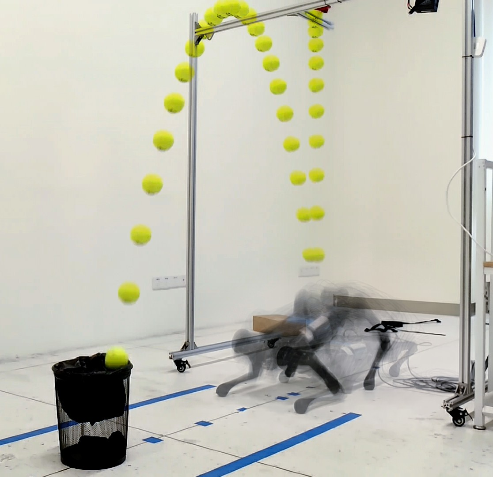

### Hi there 👋

I am a robot enthusiast who can independently design, build and control a complex robot system, with experience and networking for rapidly building robot prototypes and coding debugging capabilities. I am interested in  Mechanical Design, Optimal Control, Legged Robots and want to build extraordinary agility robots by using optimization-based methods.

You might want to check my personal website at https://qiayuanliao.netlify.app/

