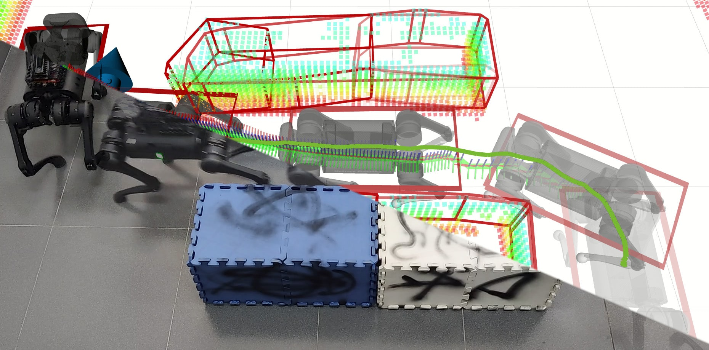

### Hi there 👋

I am a robot researcher who can independently design, build and control a complex robot system, with experience and networking for rapidly building robot prototypes and coding debugging capabilities. I am interested in Optimal Control, Mechanical Design, and Legged Robots and want to build extraordinary agility robots using optimization-based methods.

I am an incoming Ph.D. student at UC Berkeley. Now I am working as Undergraduate Researcher in SUSTech.

You might want to check my personal website at https://qiayuanliao.netlify.app/

<table class="tg">
<thead>
  <tr>
    <th class="tg-c3ow">  </th>
    <th class="tg-0pky">  </th>
  </tr>
</thead>

</table>

