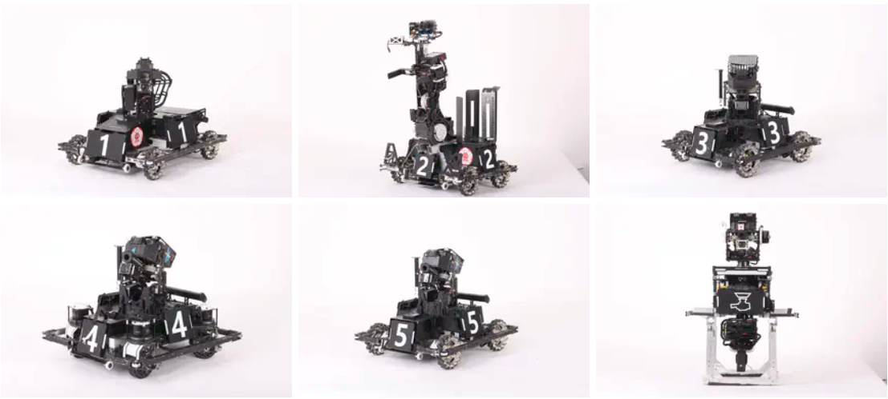

### Hi there 👋

I am a robot researcher who can independently design, build and control a complex robot system, with experience and networking for rapidly building robot prototypes and coding debugging capabilities. I am interested in Optimal Control, Mechanical Design, and Legged Robots and want to build extraordinary agility robots by using optimization-based methods.

**I’m looking for a Ph.D. position in robotics.** Please let me know if you are interested in my background and have a available position!😄️

You might want to check my personal website at https://qiayuanliao.netlify.app/

<table class="tg">
<thead>
  <tr>
    <th class="tg-c3ow">  </th>
    <th class="tg-0pky">  </th>
  </tr>
</thead>
<tbody>
  <tr>
    <td class="tg-0pky" colspan="2">  </td>
  </tr>
</tbody>
</table>

